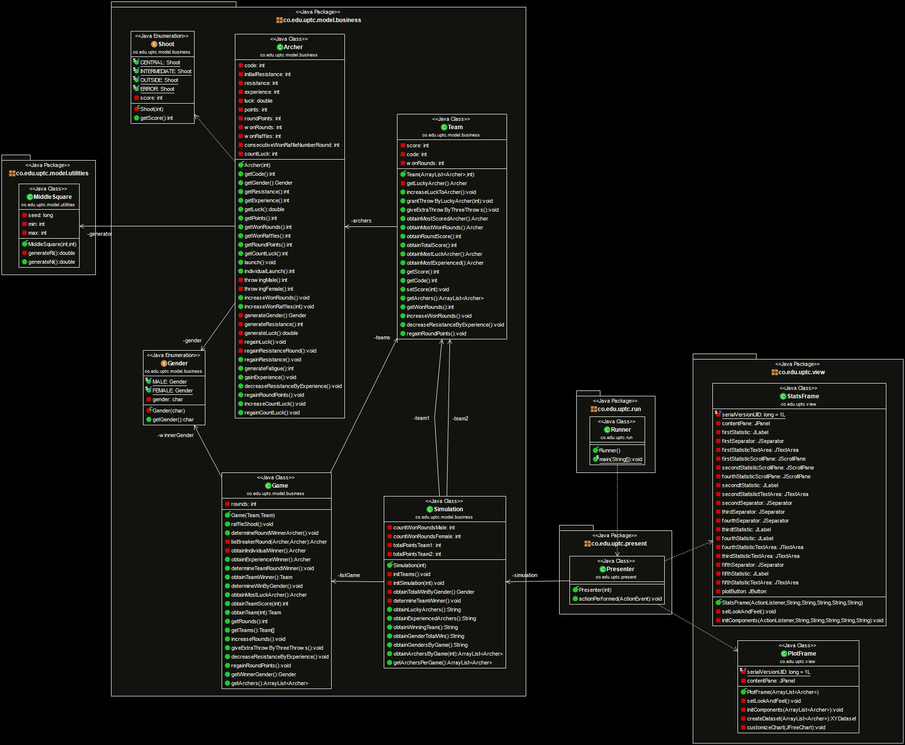

<h1 align="center">Monte Carlo Archery Game Simulator</h1>
<p align="center">
A Java-based Monte Carlo simulation that models competitive archery games between two teams, featuring probabilistic shot outcomes, fatigue mechanics, and comprehensive statistical analysis.
</p>

<h2 align="left">Index</h2>

- [Overview](#overview)
- [Core Functionality](#core-functionality)
  - [Game Structure](#game-structure)
  - [Archer Attributes](#archer-attributes)
  - [Shot Probability System](#shot-probability-system)
- [Simulation Logic](#simulation-logic)
  - [Game Flow](#game-flow)
  - [Key Mechanics](#key-mechanics)
- [Key Features](#key-features)
- [Architecture](#architecture)
  - [UML Class Model](#uml-class-model)
- [Getting Started](#getting-started)
  - [Prerequisites](#prerequisites)
  - [Installation](#installation)
- [Usage](#usage)
  - [Running the Simulation](#running-the-simulation)
  - [Viewing Visualizations](#viewing-visualizations)
  - [Customization](#customization)
- [Statistics \& Visualization](#statistics--visualization)
  - [Statistical Output](#statistical-output)
  - [Data Visualization](#data-visualization)
- [Technical Details](#technical-details)
  - [Monte Carlo Implementation](#monte-carlo-implementation)
  - [Core Classes \& Responsibilities](#core-classes--responsibilities)
  - [Performance Characteristics](#performance-characteristics)
- [Built With](#built-with)
- [Authors](#authors)
- [License\*\*](#license)

## Overview

This simulator recreates archery competitions using Monte Carlo methods to generate realistic game scenarios. It simulates 20,000 games (configurable) between two teams of 5 archers each, incorporating:

- **Probabilistic shooting**: Gender-based probability distributions for shot accuracy
- **Dynamic attributes**: Resistance (stamina), experience, and luck that change during gameplay
- **Complex game mechanics**: Raffles, bonus shots, tie-breakers, and fatigue systems
- **Statistical analysis**: Comprehensive metrics and visualization of simulation results

## Core Functionality

### Game Structure

- **Teams**: 2 teams with 5 archers each (Archers 1-5 vs Archers 6-10)
- **Games**: Each game consists of 10 rounds
- **Rounds**: In each round, archers shoot until their resistance is depleted
- **Scoring**: Points are awarded based on target zones hit (Central=10, Intermediate=9, Outside=8, Error=0)

### Archer Attributes

Each archer has dynamically changing attributes:

```text
// Initial values (randomized at game start)
Gender: Male/Female (50% probability each)
Resistance: 25-45 points (random range)
Experience: 10 points (starting value)
Luck: 1-3 (recalculated each round)
```

### Shot Probability System

The Monte Carlo method uses different probability distributions based on gender:

| Target Zone  | Female Probability | Male Probability | Score |
|--------------|-------------------|------------------|-------|
| Central      | 30%               | 20%              | 10    |
| Intermediate | 38%               | 33%              | 9     |
| Outside      | 27%               | 40%              | 8     |
| Error        | 5%                | 7%               | 0     |

## Simulation Logic

### Game Flow

1. **Initialization**: Create fresh teams with randomized archer attributes
2. **Round Execution** (10 rounds per game):
   - Each archer shoots until resistance ≤ 0 (each shot costs 5 resistance points)
   - Lucky archer from each team gets a raffled bonus shot
   - Bonus shots awarded for 3+ consecutive raffle wins
   - Individual round winner determined (highest points, with tie-breaker)
   - Team round winner determined (highest team total)
3. **Game Conclusion**: Determine overall winners and update statistics

### Key Mechanics

**Fatigue System**:

- Each shot consumes 5 resistance points
- End of round: resistance reduces by 1-2 points (random fatigue)
- Archers with 9+ experience lose only 1 resistance point for 2 rounds

**Experience System**:

- Round winners gain 3 experience points
- Higher experience provides resistance advantages

**Luck & Raffles**:

- Luck value (1-3) recalculated each round
- Luckiest archer per team gets bonus shot each round
- 3 consecutive raffle wins = additional bonus shot

## Key Features

- **Scalable Simulation**: Configurable number of games (default: 20,000)
- **Real-time Statistics**: Tracks lucky archers, experienced players, team performance
- **Gender Analysis**: Monitors male vs female performance across games
- **Data Visualization**: Interactive charts showing archer performance trends
- **Clean Architecture**: Well-structured OOP design with clear separation of concerns

## Architecture

The project follows a layered architecture pattern:

```text
src/
├── model/business/     # Core domain logic
│   ├── Simulation.java    # Main simulation orchestrator
│   ├── Game.java         # Individual game management
│   ├── Team.java         # Team operations & scoring
│   ├── Archer.java       # Archer attributes & shooting logic
│   ├── Shoot.java        # Shot outcome enumeration
│   └── Gender.java       # Gender enumeration
├── model/utilities/    # Support components
│   └── MiddleSquare.java  # Pseudo-random number generator
├── present/           # Application controller
│   └── Presenter.java    # Event handling & coordination
├── view/             # User interface
│   ├── StatsFrame.java   # Statistics display window
│   └── PlotFrame.java    # Chart visualization window
└── run/              # Application entry point
    └── Runner.java       # Main class
```

### UML Class Model

[](https://raw.githubusercontent.com/danieltorrez29/MonteCarloArcheryGameSimulator/refs/heads/master/resources/images/diagrams/monte-carlo-archery-game-simulator-class-diagram.jpg)

## Getting Started

### Prerequisites

- Java 17 or higher
- JFreeChart library (included in `lib/` directory)

### Installation

1. Clone the repository:

   ```bash
   git clone https://github.com/danieltorrez29/MonteCarloArcheryGameSimulator.git
   cd MonteCarloArcheryGameSimulator
   ```

2. Compile the project:

   ```bash
   javac -cp "lib/*" -d bin src/co/edu/uptc/**/*.java
   ```

3. Run the simulation:

   ```bash
   java -cp "bin;lib/*" co.edu.uptc.run.Runner
   ```

## Usage

### Running the Simulation

Execute the `Runner` class to start the simulation. The program will:

1. **Initialize**: Create the simulation environment
2. **Execute**: Run the specified number of games (default: 20,000)
3. **Display Results**: Open a statistics window showing:
   - Most lucky archers per game
   - Most experienced archers per game
   - Winning team with total points
   - Gender distribution of winners
   - Overall winning gender

### Viewing Visualizations

Click the "Archers Score vs 250 Games - Plot" button to view:

- Line chart showing cumulative points for each archer
- Performance trends across the first 250 games
- Comparative analysis between different archers

### Customization

Modify the number of games in `Runner.java`:

```java
public static void main(String[] args) {
    new Presenter(10000); // Change from default 20000
}
```

## Statistics & Visualization

### Statistical Output

The simulation generates comprehensive statistics including:

- **Lucky Archers**: Identifies the archer with the most raffle wins per game
- **Experienced Archers**: Tracks the most experienced archer (highest experience points) per game
- **Team Performance**: Shows winning team with total accumulated points across all games
- **Gender Analysis**:
  - Winners by gender for each individual game
  - Overall gender that wins more games across the entire simulation

### Data Visualization

The integrated plotting system provides:

- **Performance Charts**: XY line plots showing cumulative points for each archer
- **Trend Analysis**: Visual comparison of archer performance over first 250 games
- **Real-time Updates**: Charts generated from live simulation data

## Technical Details

### Monte Carlo Implementation

The simulation uses the **Middle Square Method** for pseudo-random number generation:

```java
public class MiddleSquare {
    private long seed;  // Uses SecureRandom for initial seed
    
    public double generateNi() {
        // Square the seed, extract middle digits
        // Returns normalized value [0,1)
    }
}
```

### Core Classes & Responsibilities

**Simulation.java**: Main orchestrator

- Manages game lifecycle and statistics collection
- Coordinates team creation and game execution
- Generates summary reports and visualizations

**Archer.java**: Individual player logic

- Implements probabilistic shooting mechanics
- Manages dynamic attributes (resistance, experience, luck)
- Handles fatigue and recovery systems

- Java SE 17 or older.

- Orchestrates 10-round game structure
- Manages tie-breaker scenarios
- Determines individual and team winners

**Team.java**: Team-level operations

- Aggregates archer performance
- Handles team scoring and round victories
- Manages luck-based raffle mechanics

### Performance Characteristics

- **Execution Time**: ~15-20 seconds for 20,000 games
- **Memory Usage**: Lightweight - stores only summary statistics
- **Scalability**: Linear time complexity O(n) with number of games

## Built With

- **Java 17** - Core programming language and runtime
- **JFreeChart 1.0.19** - Chart generation and visualization library
- **JCommon 1.0.23** - Supporting library for JFreeChart
- **Swing** - GUI framework for user interface components

## Authors
- [@danieltorrez29](https://github.com/danieltorrez29) – Systems and Computer Engineer - Database Specialist.
- [@JorgeEdilMz](https://github.com/JorgeEdilMz) – Systems and Computer Engineer.

## License**

This project is licensed under the MIT License - see the [LICENSE](LICENSE) file for details.
